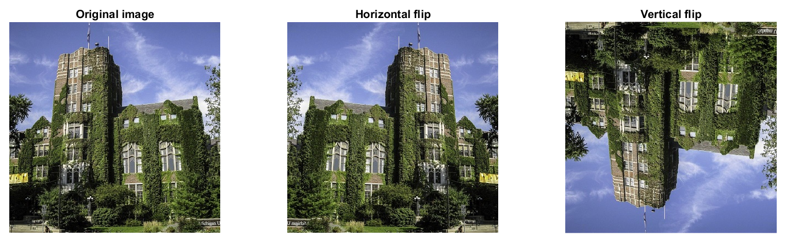
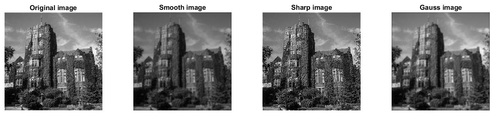
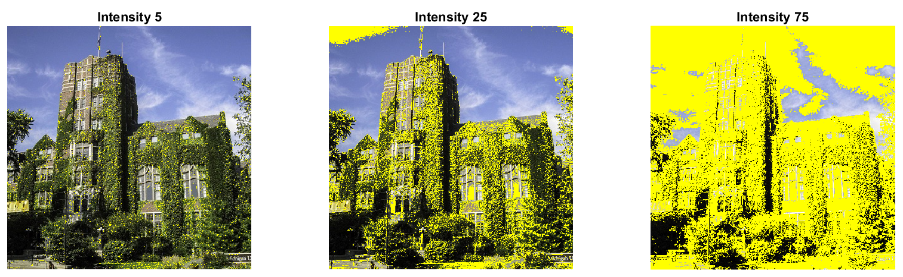

MATLAB Computer Vision practice
------
Practice so far...

**1. Weighted grayscale image conversion (imageshow.m)**
- Luminosity method is used to adjust the color channel contributions to the grayscale image. I experimented with various weights. No significant change in appearance.

**2. Horizontal and Vertical image flipping (imageman.m)**
- No built-in method used. Created loops to flip images both vertically and horizontally.

**3. Convolution filters (convolution.m)**
- 2D convolution operation with various pre-defined filters can manipulate image.

**4. Image highligting (pooling.m and highlight.m)**
- Showing those pixels which are highly bright. With appropriate parameters, this method can reveal the direction of sunlight on the surface.
