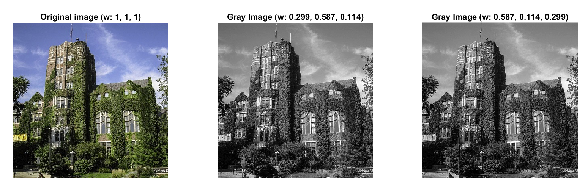

MATLAB Computer Vision practice
------
Practice so far...

**1. Weighted grayscale image conversion**
- Luminosity method is used to adjust the color channel contributions to the grayscale image. I experimented with various weights. No significant change in appearance.
